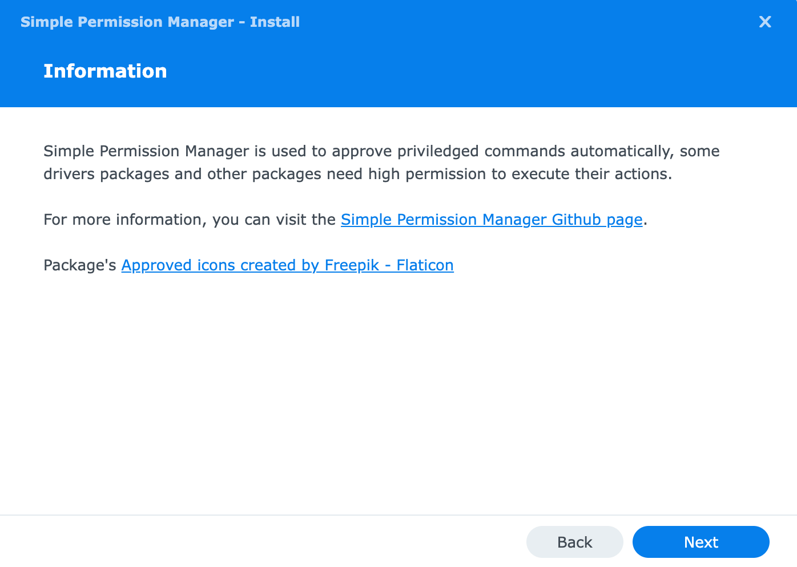
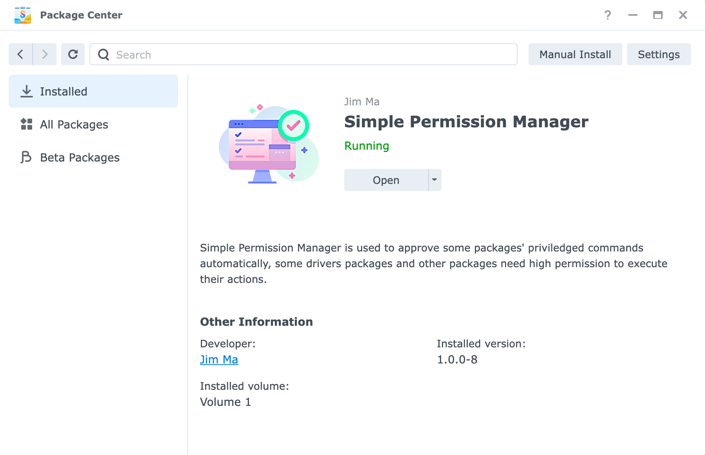
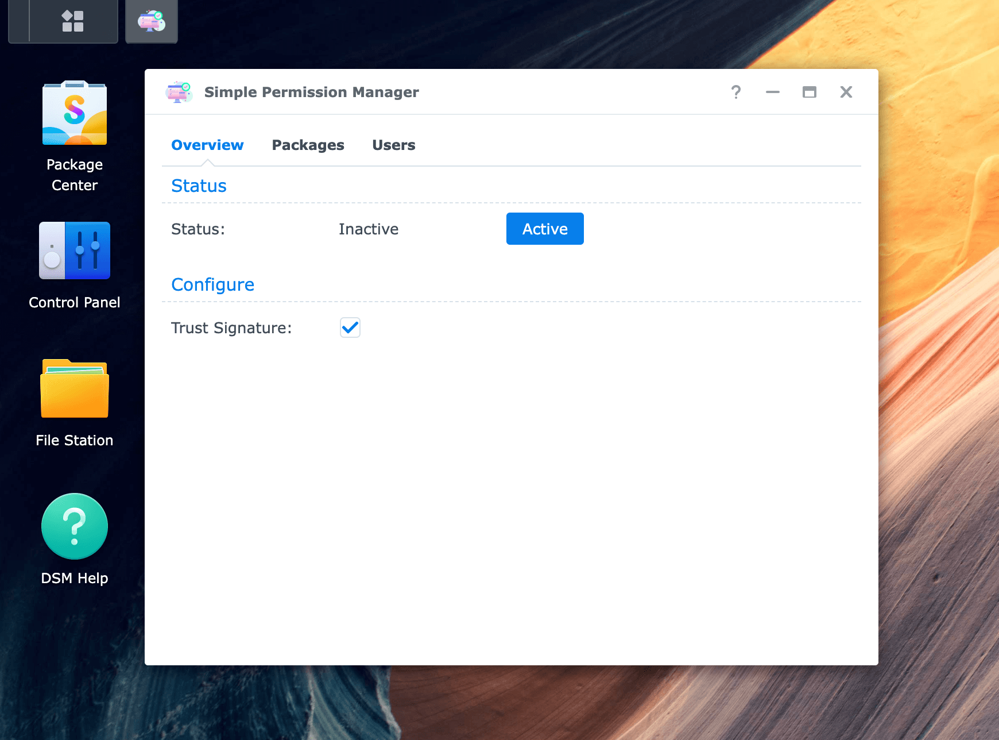
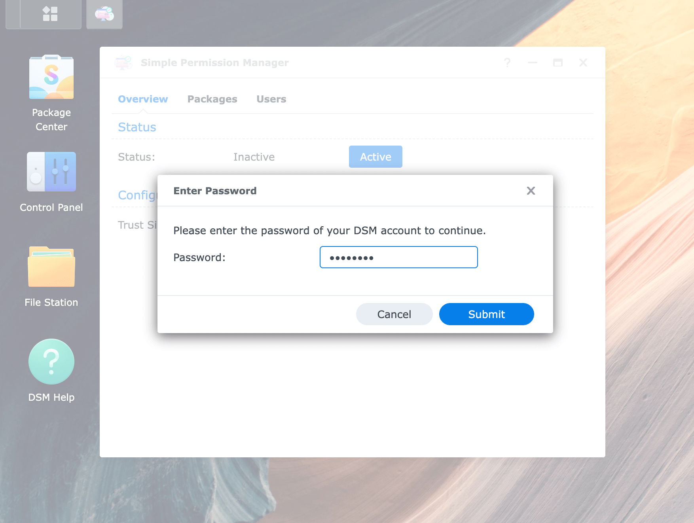
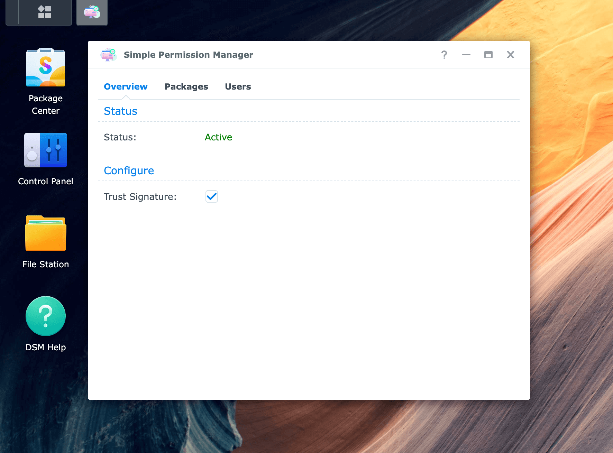

# Simple Permission Manager

`Simple Permission Manager` is used to approve some packages' priviledged commands automatically, some drivers packages and other packages need high permission to execute their actions.

## User Guide

### Installation

1. Download package from https://github.com/XPEnology-Community/SimplePermissionManager/releases

2. Install `Simple Permission Manager` in `Package Center`



3. Open `Simple Permission Manager`

* From `Package Center`



* From `Main Menu`



3. Click `Active` button


4. Type password



5. Actived



### Manually Approve Package Guide

1. Open `Simple Permission Manager` in DSM
2. Click `Package` in tab
3. Enable target package by clicking checkbox

### Manually Approve User Guide

1. Open `Simple Permission Manager` in DSM
2. Click `User` in tab
3. Enable target user by clicking checkbox

## Devloper Guide

### Auto Approve Guide

#### Generate Middle Public Key Signature

> Prepare gpg key before the following steps

1. Export middle public key

```shell
gpg --output public.pgp --export 'Hello World <hello@world.com>'
```

2. Send public key to Jim to sign by root key

```shell
gpg --output public.pgp.sig --detach-sign public.pgp
```

3. Save middle public key signature

Save `public.pgp` and `public.pgp.sig`

#### Generate Binary Signature

1. Sign by middle key

```shell
gpg --output hello-world.sh.gpg.sig --detach-sign hello-world.sh
```

2. Save binary signature

File name: `hello-world.sh.sig`

```json
{
    "version": 1,
    "signature": "<base64 format read binary signature>",
    "publicKeys": [
        {
            "publicKey": "<base64 format middle public key>",
            "signature": "<base64 format middle public signature>"
        }
    ]
}
```

##### Sign Script

```shell
file=hello-world.sh

pub_key=$(base64 -w 0 public.pgp)
pub_sig=$(base64 -w 0 public.pgp.sig)

sha256=$(sha256sum $file | awk '{print $1}')
gpg --output "$file".gpg.sig --detach-sign "$file"
sig=$(base64 -w 0 "$file".gpg.sig)
rm -f "$file".gpg.sig

cat << EOF > "$file".sig
{
    "version": 1,
    "sha256": "${sha256}",
    "signature": "${sig}",
    "publicKeys": [
        {
            "publicKey": "${pub_key}",
            "signature": "${pub_sig}"
        }
    ]
}
EOF
```

### Run Command in Packages

```
## check permission first
if [ ! -e /usr/local/bin/spm-exec ]; then
    echo "ERROR: /usr/local/bin/spm-exec not found. Please install SimplePermissionManager package and active it."
    exit 1
fi

st=$(stat -c "%U %G %a" /usr/local/bin/spm-exec)
if [ ! "$st" = "root root 6755" ]; then
    echo "ERROR: /usr/local/bin/spm-exec permission is not ready. Please active SimplePermissionManager."
    exit 1
fi

## 1. execute target command
/usr/local/bin/spm-exec /path/to/hello-world.sh

## 2. execute target command and store pid
## if need check status with pid, please ensure parent script is root
## or also call spm-exec to check status,
## like: spm-exec kill -0 $pid, or proxy all script to spm-exec, eg:
## for start-stop-status, we can call spm-exec like this:
##     start-stop-status -> spm-exec real-start-stop-status > real-start-stop-status
/usr/local/bin/spm-exec -pid /path/to/pid /path/to/hello-world.sh
```